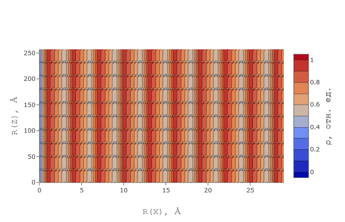

# EDXRD / Electron Density and X-Ray Diffraction
Application for calculating electron density and X-ray diffraction of molecular systems

> An example of calculating the theoretical electron density for a stearic acid layer (two-dimensional) 

## Features
* Electron Density
    * One-dimensional
        * X axis 
        * Y axis 
        * Z axis 
    * Two-dimensional
        * Surface contour plot 
    * Three-dimensional 
        * Three-dimensional surface
* X-Ray Diffraction
    * One-dimensional
        * X axis
    * Two-dimensional
        * Surface contour plot 
    * Three-dimensional 
        * Three-dimensional surface

## Usage
The application requires a server. For example [http-server](https://github.com/http-party/http-server).